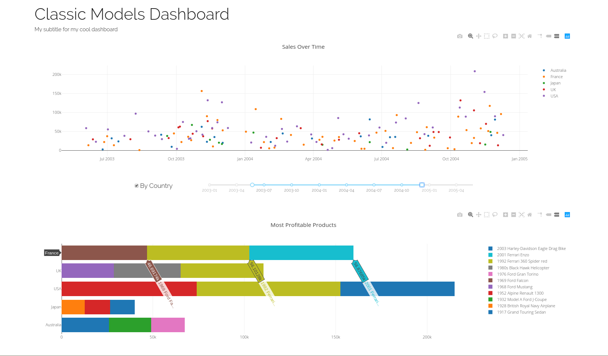

# Dash Tutorial


This tutorial will get you up and running with Dash, a Python framework for dashboards built by the folks at Plotly.

Our goal will be to create a dashboard on top of the Postgres data warehouse we built in the [analytics-databases]() module. We will build a dashboard that views some basic statistics from that database.

## Installation and Styling Basics

First you will need to create a new folder and create a virtual environment:

``` shell
mkdir dash-tutorial
cd dash-tutorial
python3 -m venv venv && source venv/bin/activate
```

Now install the following libraries:

``` shell
nnnnpip install dash==1.6.1 dash-daq==0.3.1 pandas psycopg2-binary records
```

And create an `app.py` file in the root of the project with the following code:

``` python
import dash
import dash_html_components as html


app = dash.Dash('dash-tutorial')

app.layout = html.Div(className = 'layout', children = [
    html.H1('Classic Models Dashboard'),
    html.H4('My subtitle for my cool dashboard', className='subtitle')
])

app.run_server(debug=True)
```

Try running it with `python app.py` and opening your browser to http://localhost:8050.

You should be able to see your dashboard! Try changing the text in the Python file and saving. You don't need to stop/start the Python process, it auto-reloads the file! You should see the changes reflected in your browser. Try adding other HTML elements (P, A, etc.) and try inspecting the html in your browser too to see what changes.

Great, now let's make it look a bit better with CSS. First we create an `assets` folder, which Dash will automagically include for us. Next, we add a "CSS reset", which just makes CSS a little easier to work with by getting rid of defaults:

``` shell
mkdir assets
cd assets
touch main.css
wget -O _reset.css https://meyerweb.com/eric/tools/css/reset/reset.css
```

Take a look at the page, you should notice a slight difference in spacing!

Now let's add some styling, modify the `main.css` file to look like:


``` css
@import url('https://fonts.googleapis.com/css?family=Raleway:300,400,600&display=swap');

body {
  font-weight: 300;
  font-family: "Raleway", Helvetica, sans-serif;
  color: #222;
}

h1, h2, h3, h4, h5, h6 {
  font-weight: inherit;
}
```

There are two steps to changing the font. The first is loading it (from Google, for example, as above), which makes a GET request and collects the font information, the second step is declaring it in the CSS itself, which we did when we declared the font-family for the "body". If you remember, HTML is made up of "meta" and "body", with the body containing all the content. So any styling we put on the "body" affects everything we see!

Try to change the font! Take a look at Google Fonts and find one you like.

Now, let's make a "container" which will hold most of the content of our dashboard:

``` css
.layout {
  width: 85%;
  max-width: 1600px;
  margin: 0 auto;
}
```

Try changing the width of your browser, see what happens.

Next, let's try and give the title a bit of breathing room. To do that, let's add a className to the H1 element:

``` python
    html.H1(className = 'title', children = 'Classic Models Dashboard'),
```

Now we can attach a style to that element by using the class. Write this in your `main.css` file:

``` css
.title {
  font-size: 3em;
  margin: 1.5em 0 0.3em 0;
}
```

That should feel a bit better.

## Components and Plots

Add this to your `app.py`:

``` python
import dash_core_components as dcc
```

The main functionality of Dash comes from these components. You can take a look at their documentation here: https://dash.plot.ly/dash-core-components.

Previously, we just used plain-jane HTML components (H1, Div), but the dash_core_components are supercharged with functionality we will want. These components consist of items on the page that we either want the user to interact with or that we want to display data.

Let's start by adding a `Graph` to our layout. Add this:

``` python
dcc.Graph(id='timeline', figure={})
```

Do you see the graph on the page?

Now we just need to get some data into that graph. Let's get some data from your Postgres data warehouse!

1. Connect to your data warehouse and get ALL the order facts with their dates and the amount of the sale.

2. Put the data in a pandas dataframe.

3. The dataframe should look like this:

``` python
             dt sales_amount
0    2003-01-06      4080.00
1    2003-01-06      1729.21
2    2003-01-06      1660.12
3    2003-01-06      2754.50
4    2003-01-09      2701.50
...         ...          ...
2991 2005-05-31      6261.71
2992 2005-05-31       986.42
2993 2005-05-31      3435.39
2994 2005-05-31       553.52
2995 2005-05-31      1708.56
```

Now, put the data into the graph:

``` python
# Import plotly graph objects as go!
import plotly.graph_objs as go

# replace the Graph in your layout so that it looks like this:
# where df is your dataframe, dt is the datetime column,
# and sales_amount is the sales amount column.

dcc.Graph(id='timeline', figure={
    'data': [go.Scatter(x = df.dt,
                        y = df.sales_amount,
                        ids = df.index, mode = 'markers') ],
    'layout': {
        'title': 'Sales Over Time'
    }
})
```

You should see a plot of all the order line items!

Clearly plotting every order fact is not very useful. Let's make it more useful: group some dimension (week or day or order, for example), and sum the sales amounts together so that we have a better sense of how things go over time.

I chose to group by week. I think it looks reasonable this way (note, if you group by week, you should pick a representative "date" for that week to plot by, for example by using `min()` to pick the first date the in the group).

This is great, but we want some user interaction! For example, maybe we'd like to see this broken out by country.

This is where things get interesting. We will need some way to connect the value of the checkbox to the code that produces the graph. Dash thinks of this as connecting an "Input" to an "Output". The Output will be the graph, the Input will be a checkbox.

The method for connecting the two will be a function to which we apply a special `decorator`. The function allows us to perform any code we want as we translate the data from the Input into data for the output. You can read more about decorators [here](https://www.datacamp.com/community/tutorials/decorators-python), but what you need to know for now is that decorators start with @, are written just before a function, and are themselves functions that can sometimes take arguments.

First, let's create a checkbox that will be used to switch between viewing the aggregated and disaggregated numbers. Add this to your layout:


``` python
html.Div(className='timeline-controls', children = [
    dcc.Checklist(id = 'country-checkbox',
                  options = [ {'label': 'By Country', 'value': 'by_country'}])
]),
```

Now take a look at your page, you should have a checkbox! Examine the HTML in the inspector in the browser.

Let's style the checkbox to be in a better place. Take a look at the HTML in the browser inspector. Note we added a div with the class 'timeline-controls', we can use that to move the checkbox around:

``` css
.timeline-controls {
  display: flex;
  justify-content: space-around;
}

.timeline-controls label {
  font-size: 1.2em;
}
```

The first block centers the children of `.timeline-controls` inside of it horizontally, which looks more reasonable. The second block makes any `label` element that is a descendent of `.timeline-controls` have a larger font size.

Ok, great, but clicking it does nothing. Now we will need to create a function that will take care of a our logic. Put the following function somewhere in your `app.py` file:

``` python

from dash.dependencies import Input, Output

@app.callback(
    Output('foo', 'children'),
    [Input('country-checkbox', 'value')]
)
def timeline(boxes):
    print(boxes)
    return 'foo' if boxes else 'bar'
```

And put this somewhere in your layout:

``` python
html.Div(id = 'foo')
```

You should see that you can change the content of the div! Also, you should see the output of "boxes" in your terminal. What happened? Callbacks work like this:

The output takes a `component_id` and `component_property`. Dash will find the component, in the layout, that has that id and change the property defined in property to equal whatever is returned by the function. In this case, we are setting the `children` property of a div element to be a string.

Now it's time to do some real work. Let's change the output component_id from `foo` to `timeline`, which is our graph, and change the property from `children` to `figure`. Now we already know we need to return a "figure" object from this function, So let's just try and return the same figure object we used before (ignoring the parameter of "boxes" for now), and see if everything works.

Great!

Now let's create a plot which has different colors. The way to do this with plotly is by creating multiple "traces". Note that previously, in the "figure" property of `dcc.Graph` we passed "data" as a list, but with only one element. Each element in that list is a "trace." To plot the sales for each country separately, we just need to create a "trace" for each country:

First, we need a dataframe that looks like this:

``` python
    sales_amount         dt    year  week    country
0       27695.54 2005-03-23  2005.0  12.0        USA
1       12538.01 2004-09-03  2004.0  36.0         UK
2       15718.61 2003-01-06  2003.0   2.0        USA
3        4465.85 2003-10-02  2003.0  40.0        USA
4       38350.15 2003-09-19  2003.0  38.0      Japan
..           ...        ...     ...   ...        ...
220     46968.52 2005-03-01  2005.0   9.0     France
221      3516.04 2005-03-02  2005.0   9.0      Japan
222     15822.84 2004-11-16  2004.0  47.0      Japan
223     37281.36 2004-06-03  2004.0  23.0  Australia
224     55601.84 2003-07-02  2003.0  27.0        USA
```

Then we can use it to create a "trace" for each country:

``` python
data = [go.Scatter(x = d.dt,
                   y = d.sales_amount,
                   ids = d.index,
                   mode = 'markers',
                   name = country)
        for country,d in df.groupby('country')]

```

Now! Modify your `timeline` function so that, if the `boxes` parameter is not None and contains the string "by_country", it returns a figure with a trace per country (as above) and if _not_ then it returns data with a single trace (as before).

## More graphs

Let's create another graph, a simple bar chart, which shows the top selling product. Add this to your layout (after everything else):

``` python
dcc.Graph(id='products', figure = {})
```

Great, now we have two graphs! Let's go about populating this new graph. We can make a function with a callback decorator that ALSO takes the checkboxes as an input:

``` python
@app.callback(
    Output('products', 'figure'),
    [Input('country-checkbox', 'value')]
)
def products(boxes):
    return {'data': [],
            'layout': {'title': 'Most Profitable Products',
                       'yaxis': {'automargin': True},
                       'barmode': 'stack' }}
```

Now we just need to do some more SQL writing (<3). You should be able to use the queries from your second homework for this one!

Write 1 or 2 queries so that you can create two dataframes:

1. Consists of the top N products, by sales amount. For example, for the TOP 5, it should look like this:

``` python
                          product_name sales_amount
0           1992 Ferrari 360 Spider red    276839.98
1                     2001 Ferrari Enzo    190755.86
2              1952 Alpine Renault 1300    190017.96
3  2003 Harley-Davidson Eagle Drag Bike    170686.00
4                     1968 Ford Mustang    161531.48
```

2. Consists of the top N products, by sales amount, per country of employee that sold it. It should look like this:

``` python
      country                          product_name sales_amount
0   Australia              1917 Grand Touring Sedan     31550.30
1   Australia  2003 Harley-Davidson Eagle Drag Bike     31032.17
2   Australia                1928 Mercedes-Benz SSK     30282.95
3      France           1992 Ferrari 360 Spider red    114313.77
4      France                     2001 Ferrari Enzo     79693.31
5      France               1956 Porsche 356A Coupe     61964.59
6       Japan                    1969 Corvair Monza     16440.84
7       Japan                      1969 Ford Falcon     15623.90
8       Japan              1952 Alpine Renault 1300     13889.04
9          UK           1992 Ferrari 360 Spider red     50924.05
10         UK           1980s Black Hawk Helicopter     40622.53
11         UK                     1968 Ford Mustang     39268.13
12        USA              1952 Alpine Renault 1300     93160.63
13        USA           1992 Ferrari 360 Spider red     86082.26
14        USA  2003 Harley-Davidson Eagle Drag Bike     74524.35
```

Now, we can put the data in the figure in our new graph like this when we view by country:

``` python
data = [go.Bar(ids = d.index,
               x = d.sales_amount,
               y = d.country,
               orientation='h',
               name = product)
        for product,d in df.groupby('product_name')]
```

And like this when we view all together:

``` python
data = [go.Bar(ids = df.index,
               x = df.sales_amount,
               y = df.product_name,
               orientation='h')]
```


## Multiple Inputs

Callbacks can take multiple inputs, which just become multiple parameters of the function that is decorated!

Let's make a slider so that we can also pick the timeframe that we are interested in. Let's add this to the "timeline-controls" div in our layout:

``` python
dcc.RangeSlider(
    id='year-slider',
    min=2003,
    max=2005,
    value=[2003, 2005],
    marks = {2003: 'year-2003', 2004: 'year-2004', 2005: 'year-2005'}
)
```

And we'll add this to the `main.css` to make it look decent:

``` css
.timeline-controls {
  display: flex;
  justify-content: space-around;
  width: 70%;
  margin: 0 auto;
}

#year-slider {
  width: 70%;
}

#products {
  margin: 4em 0 0 0;
}
```

Now we have a range slider! That was mostly to see how it works. Now let's create one that's more continuous. Instead of just years, we'll use "timestamps", which is the number of milliseconds since "epoch" (when Unix was invented!). Write these somewhere in your `app.py` file (note, the file is starting to get busy, maybe you should start splitting it up!):

``` python
from datetime import datetime
from dateutil.relativedelta import relativedelta

def get_marks(start, end):
    result = []
    current = start
    while current <= end:
        result.append(current)
        current += relativedelta(months=3)
    return {int(m.timestamp()): m.strftime('%Y-%m') for m in result}

MIN_TIME = datetime(2003,1,1)
MAX_TIME = datetime(2005,12,31)
```

BONUS: add a small function to get the MIN/MAX time from your Postgres database, from the data, rather than hardcoding it here!

Now adjust the slider:

``` python
dcc.RangeSlider(
    id='year-slider',
    min=MIN_TIME.timestamp(),
    max=MAX_TIME.timestamp(),
    value=[MIN_TIME.timestamp(), MAX_TIME.timestamp()],
    marks = get_marks(MIN_TIME, MAX_TIME)
)
```

Now we have a beautiful slider! Next we need to actually change the data on the page to listen to the slider. We will first add it as an input to our "timeline" function:

``` python
@app.callback(
    Output('timeline', 'figure'),
    [Input('country-checkbox', 'value'),
     Input('year-slider', 'value')]
)
def timeline(boxes, time_range):
    print(time_range)
```

Take a look at what it prints, when you move the slider around! You can use the `fromtimestamp` method on `datetime` to get it back to a datetime object:

``` python
@app.callback(
    Output('timeline', 'figure'),
    [Input('country-checkbox', 'value'),
     Input('year-slider', 'value')]
)
def timeline(boxes, time_range):
    start, finish = [datetime.fromtimestamp(t) for t in time_range]
```

Now you can use the start/finish to filter your data, either in the SQL query or in the dataframe!

Do the same for the same for the products!

And now enjoy your beautiful dashboard:



## Deployment

Under the hood, Dash is using Flask, a popular Python web framework!

`app.server` will recover the flask server itself. Given the flask server, we use other libraries to run the server on multiple threads. One of those is gevent. If you have the dash "app" variable in the module `app.py`, you simply need a `server.py` that looks like this:


```python
from gevent.pywsgi import WSGIServer
from app import app

http_server = WSGIServer(('', 5000), app.server)
http_server.serve_forever()
```

And change your `app.py` to get rid of the `run_server` line:

``` python
app.run_server(debug=True) # delete this line!
```

Now your production code runs `python server.py` and the server is listening on port 5000 (you can change that directly in the code)!
